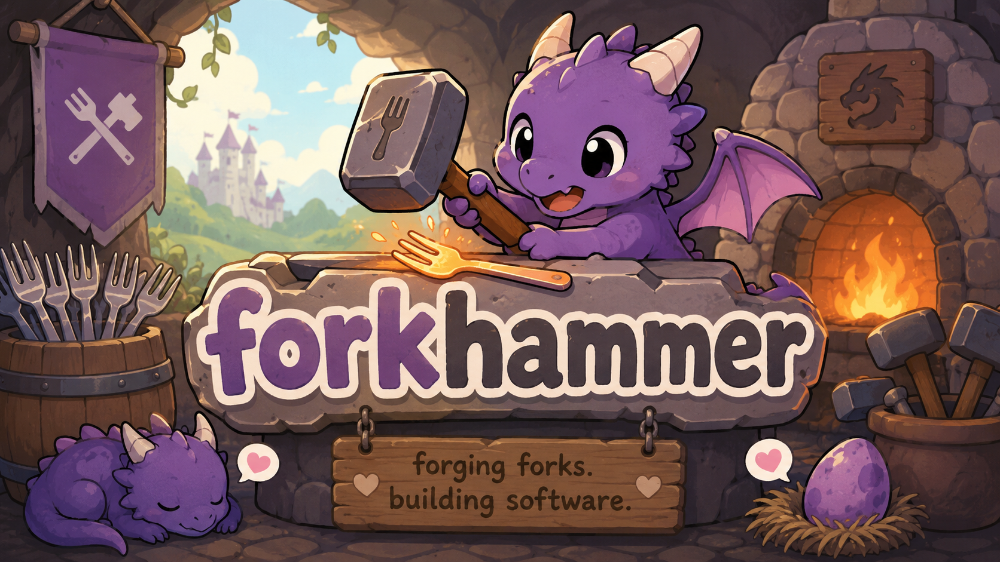

# forkhammer



Forkhammer is a local, event-sourced validation system for Jira issues.

It uses Jira for issue context, Supabase for the event log, OpenCode for agent sessions, and git worktrees for isolated repository state.

## Docs

Most of the details live in `website/docs/`:

- [Introduction](./website/docs/intro.mdx)
- [Architecture](./website/docs/architecture.mdx)
- [Configuration](./website/docs/configuration.mdx)
- [Where UI](./website/docs/where-ui.mdx)
- [Quick Start](./website/docs/quick-start.mdx)

## Commands

```bash
bun install
bun run build
```

For docs work:

```bash
bun run docs:start
bun run docs:build
```

The docs site lives in `website/` and covers the current architecture, configuration, and Docker runtime.
